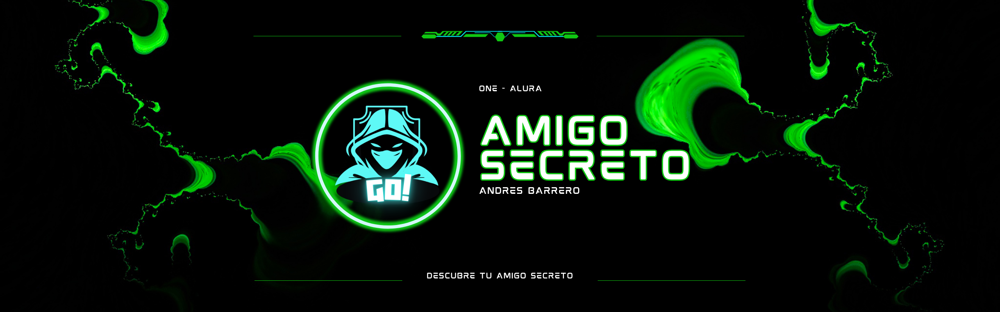

# Challenge Amigo Secreto - Personalizado AB  

## Insignias  
  
  

## Índice  
1. [Descripción del Proyecto](#descripción-del-proyecto)  
2. [Estado del Proyecto](#estado-del-proyecto)  
3. [Demostración de Funciones y Aplicaciones](#demostración-de-funciones-y-aplicaciones)  
4. [Acceso al Proyecto](#acceso-al-proyecto)  
5. [Tecnologías Utilizadas](#tecnologías-utilizadas)  
6. [Personas Contribuyentes](#personas-contribuyentes)  
7. [Personas Desarrolladoras del Proyecto](#personas-desarrolladoras-del-proyecto)  
8. [Licencia](#licencia)  

---  

## Descripción del Proyecto  

El Amigo Secreto Challenge es un proyecto diseñado para practicar conceptos de lógica de programación mediante la creación de un juego interactivo de intercambio de regalos entre amigos.
---  

## Estado del Proyecto  

En desarrollo activo. Puedes revisar el código y contribuir según las directrices de contribución.  

---  

## Demostración de Funciones y Aplicaciones  

- Agregar amigos a la lista  
- Sortear un amigo secreto de manera aleatoria  
- Reiniciar el sorteo

---  

## Acceso al Proyecto  

El proyecto está disponible en GitHub [Amigo Secreto Challenge](https://github.com/Andresarbarrero/Challenge-amigo-secreto-personalizado-AB) 

---  

## Tecnologías Utilizadas  

- JavaScript  
- HTML  
- CSS
- Canva
- Tailwindcss

---  

## Personas Contribuyentes  

--------------------------

---  

## Personas Desarrolladoras del Proyecto  

- Andrés Armando Barrero Ávila
- ONE - Alura Latam

---  

## Licencia  

Este proyecto está bajo la Licencia MIT. Consulta el archivo LICENSE para más detalles.
